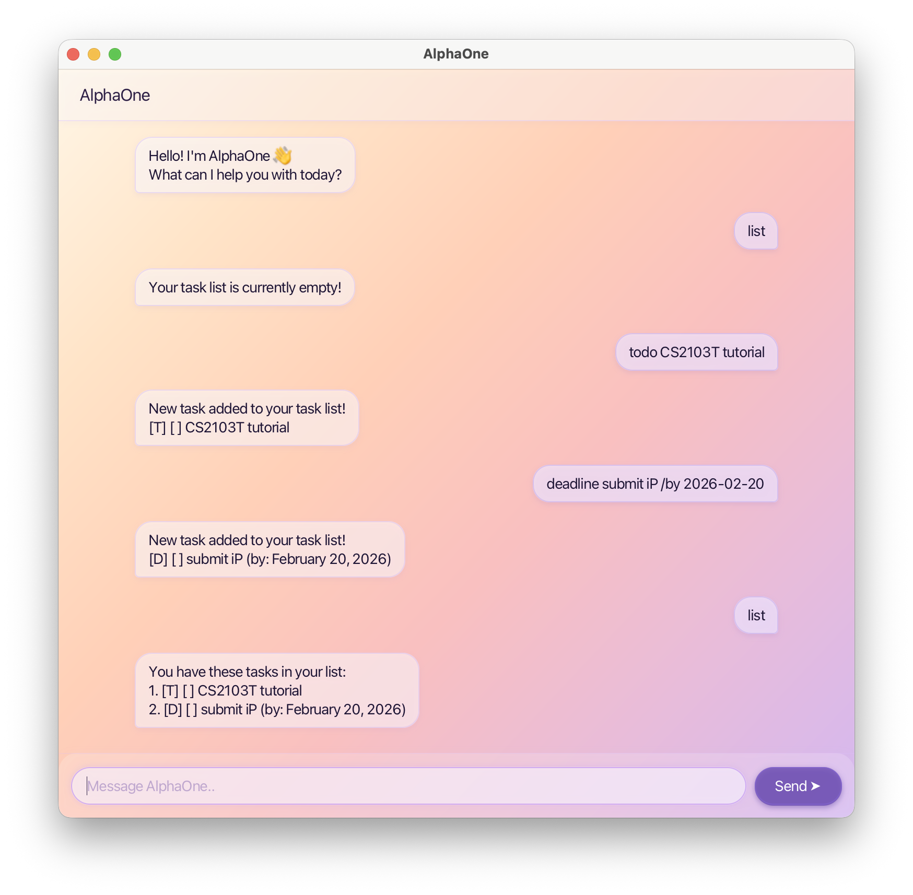

# AlphaOne User Guide

AlphaOne is a **desktop task manager** that helps you track todos, deadlines, and events — all through a simple chat-style interface. It also doubles as a lightweight contact book.



---

## Quick Start

1. Ensure you have **Java 17 or above** installed.
   - Mac users: install the [precise JDK version prescribed here](https://se-education.org/guides/tutorials/javaInstallationMac.html).
2. Download the latest `alphaone.jar` from the [releases page](https://github.com/user/ip/releases).
3. Copy the file to the folder you want to use as AlphaOne's home folder.
4. Open a terminal, `cd` into that folder, and run:
   ```
   java -jar alphaone.jar
   ```
5. A GUI window will appear in a few seconds with any previously saved tasks loaded automatically.

---

## Features

> **Note:** Words in `[square brackets]` are parameters you supply. Extra spaces between words are ignored.

---

### Add a Todo — `todo`

Adds a task with no date attached.

**Format:** `todo [description]`

**Example:**
```
todo read operating systems textbook
```
```
New task added to your task list!
[T] [ ] read operating systems textbook
```

**Errors:**

| Input | Response |
|---|---|
| `todo` | Incomplete details to create task! Please add in what you would like to do? |

---

### Add a Deadline — `deadline`

Adds a task with a due date.

**Format:** `deadline [description] /by [YYYY-MM-DD]`

**Example:**
```
deadline submit assignment /by 2026-03-15
```
```
New task added to your task list!
[D] [ ] submit assignment (by: March 15, 2026)
```

**Errors:**

| Input | Response |
|---|---|
| `deadline submit assignment` | Invalid DEADLINE command — missing `/by` marker. |
| `deadline /by 2026-03-15` | Invalid DEADLINE command — missing description. |
| `deadline submit assignment /by 15-03-2026` | Datetime information provided is invalid! For Deadline tasks, use YYYY-MM-DD (e.g., 2025-02-19). |
| `deadline submit assignment /by` | Incomplete details — please add a due date after `/by`. |

---

### Add an Event — `event`

Adds a task with a start and end date-time.

**Format:** `event [description] /from [YYYY-MM-DD HHmm] /to [YYYY-MM-DD HHmm]`

**Example:**
```
event team meeting /from 2026-03-10 1400 /to 2026-03-10 1600
```
```
New task added to your task list!
[E] [ ] team meeting (from March 10, 2026 02:00 PM to March 10, 2026 04:00 PM)
```

**Errors:**

| Input | Response |
|---|---|
| `event team meeting` | Invalid EVENT command — missing `/from` and `/to` markers. |
| `event team meeting /from 2026-03-10 1400` | Invalid EVENT command — missing `/to` marker. |
| `event team meeting /from 2026/03/10 1400 /to 2026/03/10 1600` | Datetime information provided is invalid! For Event tasks, use YYYY-MM-DD HHMM (e.g., 2026-02-19 1430). |
| `event team meeting /from /to 2026-03-10 1600` | Invalid EVENT command — missing start datetime between `/from` and `/to`. |

---

### List All Tasks — `list`

Displays all tasks with their index, type, and status.

**Format:** `list`

**Example output:**
```
You have these tasks in your list:
1. [T] [ ] read operating systems textbook
2. [D] [ ] submit assignment (by: March 15, 2026)
3. [E] [ ] team meeting (from March 10, 2026 02:00 PM to March 10, 2026 04:00 PM)
```

**Icons:**

| Icon | Meaning |
|---|---|
| `[T]` | Todo |
| `[D]` | Deadline |
| `[E]` | Event |
| `[ ]` | Not done |
| `[X]` | Done |

**Errors:**

| Input | Response |
|---|---|
| `list extra` | Invalid LIST command! No other parameters required. |

---

### Mark a Task as Done — `mark`

**Format:** `mark [task number]`

**Example:**
```
mark 2
```
```
Task marked done successfully!
[D] [X] submit assignment (by: March 15, 2026)
```

**Errors:**

| Input | Response |
|---|---|
| `mark` | Invalid MARK command! Please try again. |
| `mark 99` (task doesn't exist) | Invalid Task! Please try again. |
| `mark abc` | Invalid task number! |

---

### Unmark a Task — `unmark`

Marks a previously completed task as not done.

**Format:** `unmark [task number]`

**Example:**
```
unmark 2
```
```
Task unmarked successfully!
[D] [ ] submit assignment (by: March 15, 2026)
```

**Errors:**

| Input | Response |
|---|---|
| `unmark` | Invalid UNMARK command! Please try again. |
| `unmark 99` (task doesn't exist) | Invalid Task! Please try again. |
| `unmark abc` | Invalid task number! |

---

### Delete a Task — `delete`

Permanently removes a task from the list.

**Format:** `delete [task number]`

**Example:**
```
delete 1
```
```
The following task has been deleted!
[T] [ ] read operating systems textbook
```

**Errors:**

| Input | Response |
|---|---|
| `delete` | Invalid DELETE command! Please try again. |
| `delete 99` (task doesn't exist) | Invalid Task! Please try again. |
| `delete abc` | Invalid task number! |

---

### Search Tasks — `find`

Searches all tasks for a keyword (case-sensitive substring match).

**Format:** `find [keyword]`

**Example:**
```
find assignment
```
```
These are the most relevant tasks
2. [D] [ ] submit assignment (by: March 15, 2026)
```

If no tasks match:
```
No relevant tasks found!
```

**Errors:**

| Input | Response |
|---|---|
| `find` | Invalid FIND command! Please enter keyword(s). |

---

### Manage Contacts — `contact`

AlphaOne includes a simple contact book. All changes are saved automatically.

---

#### Add a Contact — `contact add`

**Format:** `contact add [name] [phone]`

- `[phone]` must contain **digits only** (e.g. `91234567`).
- A contact is only a duplicate if **both** name and phone number are identical — the same person can be added with different numbers.

**Example:**
```
contact add John Doe 91234567
```
```
New contact added:
John Doe (91234567)
```

**Errors:**

| Input | Response |
|---|---|
| `contact add John Doe` | Phone number cannot be empty. |
| `contact add 91234567` | Contact name cannot be empty. |
| `contact add John Doe abc123` | "abc123" is not a valid phone number. Phone numbers must contain digits only. |
| `contact add John Doe 91234567` *(already exists)* | A contact with the name and phone number "John Doe (91234567)" already exists. |

---

#### Remove a Contact — `contact remove`

Removes the contact whose name matches (case-insensitive).

**Format:** `contact remove [name]`

**Example:**
```
contact remove John Doe
```
```
Contact removed:
John Doe (91234567)
```

**Errors:**

| Input | Response |
|---|---|
| `contact remove` | Contact name cannot be empty. |
| `contact remove Jane` *(not in list)* | No contact found with the name "Jane". Use 'contact list' to see all saved contacts. |

---

#### List All Contacts — `contact list`

**Format:** `contact list`

```
contact list
```
```
Saved contacts:
John Doe (91234567)
John Doe (98765432)
```

If no contacts are saved:
```
You have no saved contacts.
```

**Errors:**

| Input | Response |
|---|---|
| `contact list extra` | Invalid CONTACT command! Available actions: add, remove, list. |
| `contact foo` | Invalid CONTACT command! Available actions: add, remove, list. |

---

### Exit — `bye`

Saves all tasks and closes the application.

**Format:** `bye`

**Errors:**

| Input | Response |
|---|---|
| `bye now` | Invalid BYE command! No other parameters required. |

---

## Data & Storage

- Tasks are auto-saved to `data/alphaone.txt` in the home folder on every change and when you exit with `bye`.
- Contacts are saved to `data/alphaone_contacts.txt`.
- Both files are loaded automatically on the next launch — no action required.
- Do not manually edit these files; malformed lines will be skipped silently on load.

---

## Command Summary

| Action | Format |
|---|---|
| Add todo | `todo [description]` |
| Add deadline | `deadline [description] /by [YYYY-MM-DD]` |
| Add event | `event [description] /from [YYYY-MM-DD HHmm] /to [YYYY-MM-DD HHmm]` |
| List tasks | `list` |
| Mark done | `mark [task number]` |
| Unmark done | `unmark [task number]` |
| Delete task | `delete [task number]` |
| Find tasks | `find [keyword]` |
| Add contact | `contact add [name] [phone]` *(digits-only phone)* |
| Remove contact | `contact remove [name]` |
| List contacts | `contact list` |
| Exit | `bye` |
